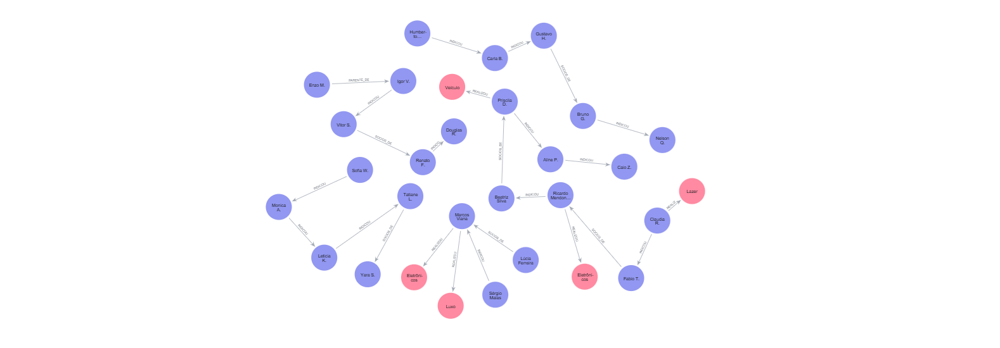

# Análise de Score bancário com o Neo4j

Este projeto foi desenvolvido como parte do desafio de modelagem de dados em Grafos, utilizando o **Neo4j**. O objetivo é ir além do Credit Score tradicional, analisando o **comportamento de rede** e a **proximidade com inadimplentes** para decisões de crédito mais assertivas.


## Contexto do Problema

Modelos de análise de crédito tradicionais (relacionais) focam no indivíduo de forma isolada (Salário vs. Dívidas). 
**Este projeto resolve:**
- Identifica se um bom pagador está cercado por uma rede de inadimplência.
- Detecta gastos incompatíveis com a renda declarada.
- Avalia o risco de "contágio" financeiro através de vínculos de sociedade e indicação.


## Modelo do Grafo

O grafo é composto por 25 pessoas interconectadas e transações de alto valor.

### Entidades (Labels):
- `:Pessoa`: Contém propriedades como `nome`, `salario`, `profissao`, `score` e `inadimplente`.
- `:Transacao`: Contém `item`, `valor`, `data` e `categoria`.

### Relacionamentos:
- `[:INDICOU]`: Estabelece um vínculo de confiança ou recomendação.
- `[:SOCIOS_DE]`: Indica vínculo jurídico e responsabilidade compartilhada.
- `[:REALIZOU]`: Conecta a pessoa ao seu histórico de consumo recente.

> **Visualização do Esquema:**


## Queries de Negócio (Insights)

### 1. Risco de Contágio (Análise de 2º Nível)
Identifica solicitantes que possuem score alto, mas estão vinculados a pessoas inadimplentes por sociedade ou indicação.
```cypher
MATCH (inad:Pessoa {inadimplente: true})-[r]-(solicitante:Pessoa {inadimplente: false})
RETURN solicitante.nome, type(r) AS Vinculo, inad.nome AS Pessoa_Risco
```


### 2. Alerta de Incompatibilidade de Renda
Filtra transações onde o valor do item supera em 200% o salário mensal do cliente.
```cypher
MATCH (p:Pessoa)-[:REALIZOU]->(t:Transacao)
WHERE t.valor > (p.salario * 2)
RETURN p.nome, p.salario, t.item, t.valor, (t.valor / p.salario) AS Multiplo_Salarial
ORDER BY Multiplo_Salarial DESC
```

### 3. Caminho Curto até o Risco
Mostra o caminho de conexões entre um cliente VIP e o inadimplente mais próximo.
```Cypher
MATCH p = shortestPath((n1:Pessoa {nome: 'Claudia R.'})-[*]-(n2:Pessoa {inadimplente: true}))
RETURN p
```


## Desafios Encontrados
Durante a modelagem, o maior desafio foi pensar em como estruturar o simples projeto de forma que fizesse sentido para o contexto inventado.

**Resolução:** Implementei relacionamentos de "Indicações Cruzadas" e "Sociedades Intersetoriais". Isso permitiu que o grafo se tornasse uma teia única, possibilitando o uso de algoritmos de busca de caminho para entender como o risco de um setor pode afetar outro.

## Como Executar
Faça o download do Neo4j Desktop ou utilize o Neo4j Sandbox.

Crie um novo projeto e abra o Neo4j Browser.Execute o script de carga abaixo para gerar o cenário completo:
<details><summary>Clique para expandir o Script de Carga</summary>Cypher// 
  // --- LIMPEZA TOTAL ---
MATCH (n) DETACH DELETE n;

// --- CRIAÇÃO DOS NÓS DE PESSOA ---
CREATE 
  (p1:Pessoa {nome: 'Ricardo Mendonça', profissao: 'Engenheiro Civil', salario: 12000, score: 920, inadimplente: false}),
  (p2:Pessoa {nome: 'Beatriz Silva', profissao: 'Médica', salario: 18000, score: 880, inadimplente: false}),
  (p3:Pessoa {nome: 'Marcos Viana', profissao: 'Vendedor Autônomo', salario: 4500, score: 710, inadimplente: false}),
  (p4:Pessoa {nome: 'Sérgio Malas', profissao: 'Motorista', salario: 3000, score: 180, inadimplente: true}),
  (p5:Pessoa {nome: 'Lúcia Ferreira', profissao: 'Comerciante', salario: 6000, score: 250, inadimplente: true}),
  (p6:Pessoa {nome: 'Fabio T.', profissao: 'Diretor Financeiro', salario: 25000, score: 980, inadimplente: false}),
  (p7:Pessoa {nome: 'Claudia R.', profissao: 'Juíza', salario: 32000, score: 990, inadimplente: false}),
  (p8:Pessoa {nome: 'Enzo M.', profissao: 'Estagiário', salario: 2000, score: 450, inadimplente: false}),
  (p9:Pessoa {nome: 'Aline P.', profissao: 'Advogada', salario: 15000, score: 890, inadimplente: false}),
  (p10:Pessoa {nome: 'Bruno G.', profissao: 'Consultor', salario: 7000, score: 680, inadimplente: false}),
  (p11:Pessoa {nome: 'Tatiane L.', profissao: 'Enfermeira', salario: 6500, score: 720, inadimplente: false}),
  (p12:Pessoa {nome: 'Gustavo H.', profissao: 'Motorista de App', salario: 3500, score: 400, inadimplente: false}),
  (p13:Pessoa {nome: 'Carla B.', profissao: 'Autônoma', salario: 3800, score: 550, inadimplente: false}),
  (p14:Pessoa {nome: 'Vitor S.', profissao: 'Vendedor', salario: 3200, score: 150, inadimplente: true}),
  (p15:Pessoa {nome: 'Douglas R.', profissao: 'Porteiro', salario: 2800, score: 320, inadimplente: true}),
  (p16:Pessoa {nome: 'Sofia W.', profissao: 'Arquiteta', salario: 9500, score: 800, inadimplente: false}),
  (p17:Pessoa {nome: 'Renato F.', profissao: 'Cozinheiro', salario: 3000, score: 210, inadimplente: true}),
  (p18:Pessoa {nome: 'Monica A.', profissao: 'Psicóloga', salario: 8500, score: 820, inadimplente: false}),
  (p19:Pessoa {nome: 'Caio Z.', profissao: 'Desenvolvedor', salario: 11000, score: 860, inadimplente: false}),
  (p20:Pessoa {nome: 'Leticia K.', profissao: 'Social Media', salario: 4500, score: 700, inadimplente: false}),
  (p21:Pessoa {nome: 'Humberto J.', profissao: 'Aposentado', salario: 5000, score: 580, inadimplente: false}),
  (p22:Pessoa {nome: 'Priscila D.', profissao: 'Dentista', salario: 14000, score: 910, inadimplente: false}),
  (p23:Pessoa {nome: 'Nelson Q.', profissao: 'Segurança', salario: 3300, score: 420, inadimplente: false}),
  (p24:Pessoa {nome: 'Yara S.', profissao: 'Professora', salario: 5500, score: 740, inadimplente: false}),
  (p25:Pessoa {nome: 'Igor V.', profissao: 'Mecânico', salario: 4200, score: 380, inadimplente: true})

// --- CRIAÇÃO DAS TRANSAÇÕES ---
CREATE 
  (t1:Transacao {item: 'Relógio de Luxo', valor: 15000, data: '2024-03-25', categoria: 'Luxo'}),
  (t2:Transacao {item: 'Smartphone High-end', valor: 8000, data: '2024-03-28', categoria: 'Eletrônicos'}),
  (t3:Transacao {item: 'Notebook Gamer', valor: 12000, data: '2024-04-02', categoria: 'Eletrônicos'}),
  (t4:Transacao {item: 'Viagem Europa', valor: 25000, data: '2024-04-05', categoria: 'Lazer'}),
  (t5:Transacao {item: 'Carro Usado', valor: 35000, data: '2024-04-06', categoria: 'Veículo'})

// --- RELACIONAMENTOS DE COMPRAS ---
CREATE (p3)-[:REALIZOU]->(t1), (p3)-[:REALIZOU]->(t2)
CREATE (p1)-[:REALIZOU]->(t3) 
CREATE (p7)-[:REALIZOU]->(t4)
CREATE (p22)-[:REALIZOU]->(t5)

// --- INTERCONECTIVIDADE TOTAL ---
CREATE (p7)-[:INDICOU]->(p6), (p6)-[:SOCIOS_DE]->(p1), (p1)-[:INDICOU]->(p2), (p2)-[:SOCIOS_DE]->(p22), (p22)-[:INDICOU]->(p9)
CREATE (p9)-[:INDICOU]->(p19), (p19)-[:SOCIOS_DE]->(p16), (p16)-[:INDICOU]->(p18), (p18)-[:INDICOU]->(p20), (p20)-[:INDICOU]->(p11)
CREATE (p4)-[:INDICOU]->(p3), (p5)-[:SOCIOS_DE]->(p3), (p3)-[:INDICOU]->(p8), (p8)-[:PARENTE_DE]->(p25), (p25)-[:INDICOU]->(p14)
CREATE (p14)-[:SOCIOS_DE]->(p17), (p17)-[:INDICOU]->(p15), (p15)-[:PARENTE_DE]->(p23)
CREATE (p11)-[:SOCIOS_DE]->(p24), (p24)-[:INDICOU]->(p21), (p21)-[:INDICOU]->(p13), (p13)-[:INDICOU]->(p12), (p12)-[:SOCIOS_DE]->(p10), (p10)-[:INDICOU]->(p23);
  
</details>Execute 
MATCH (n) RETURN n para visualizar a rede.

## Evidências Visuais

Abaixo estão as capturas de tela das análises realizadas no Neo4j Browser.

| Visão Geral do Grafo (Network) | Análise de Risco (Conexões) |
| :---: | :---: |
|  |  |
| *Representação da teia completa de 25 pessoas e transações interconectadas.* | *Destaque para o nó de risco e seus vínculos com inadimplentes.* |

---

> **Dica de Visualização:** No Neo4j Browser, utilizei a legenda de cores para identificar rapidamente o status de cada nó: **Azul** para clientes ativos, **Vermelho** para inadimplentes e **Amarelo** para transações financeiras.
